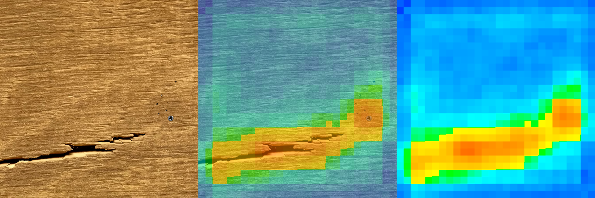
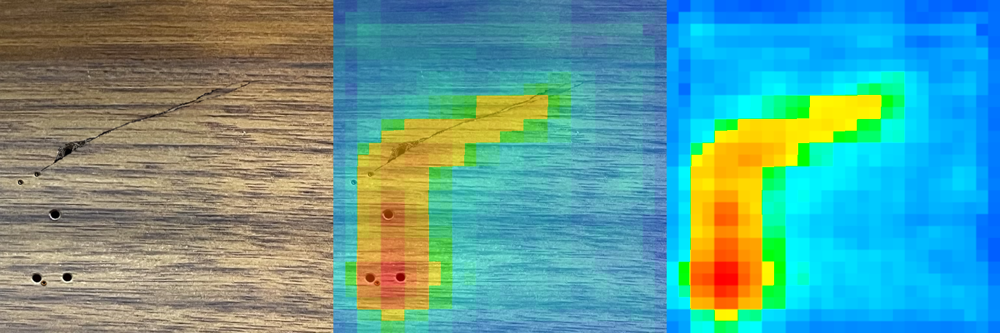
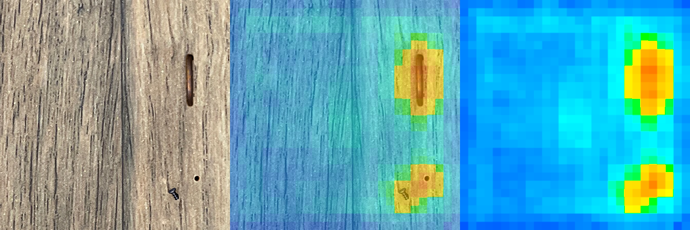

# patchcore
Implementation of anomaly detection method PatchCore.

https://arxiv.org/abs/2106.08265

## Installation
### Local
* Ubuntu20.04, 22.04
* Python 3.8

### Python package
* torch==1.13
* torchvision==0.14
* opencv-python
* scikit-learn
* torchmetrics==0.9.0
* omegaconf
* tqdm

### Docker

* docker 
* NVIDIA Container Toolkit
* docker-compose

#### GPU
```bash
source setting/init_docker.sh
./build
```

#### CPU
```bash
source setting/init_docker.sh
./build.cpu
```

#### Login container
##### GPU
```bash
./login
```

##### CPU
```bash
./login.cpu
```

## Sample dataset
sample dataset [`Download`](https://github.com/ComputermindCorp/assets/releases/download/v1.0.0/wood.zip)

```
src/data/images/wood/
├── train/
│   └── image_file...
├── val/
│   └── image_file...
└── test/
    └── image_file...
```

## Training
```
python train.py cfg/train/wide_resnet50_wood.yaml
```

[train config file document](src/cfg/train/README.md)

## Test
```
python test.py cfg/test/wide_resnet50_wood.yaml
```

[test config file document](src/cfg/test/README.md)


### trained model
* [`wide_resnet50_size224_param_0.1_9_wood.pth`](https://github.com/ComputermindCorp/assets/releases/download/v1.0.0/wide_resnet50_size224_param_0.1_9_wood.pth)
* [`resnet50_size224_param_0.1_9_wood.pth`](https://github.com/ComputermindCorp/assets/releases/download/v1.0.0/resnet50_size224_param_0.1_9_wood.pth)
* [`resnet18_size224_param_0.1_9_wood.pth`](https://github.com/ComputermindCorp/assets/releases/download/v1.0.0/resnet18_size224_param_0.1_9_wood.pth)

```
src/data/weights/
├── resnet18_size224_param_0.1_9_wood.pth
├── resnet50_size224_param_0.1_9_wood.pth
└── wide_resnet50_size224_param_0.1_9_wood.pth
```

## Evaluation results for sample data

### Parameter
| | |
|--|--|
|backborn | Wide-ResNet50 |
| coreset sampling ratio  | 0.1 |
| num_neighbors | 9 |


### Metrics 
|| Precision | Recall | F1-score |
|---|---|---|---|
| Normal | 0.8889 | 1.0000 | 0.9412 |
| Abnormal | 1.0000 | 0.8750 | 0.9333 |
| macro-mean | 0.9444 | 0.9375 | 0.9373 |

### Confusion matrix
| Label / Pred | Normal | Abnormal |
| --- | --- | --- |
| Normal | 16 | 0 |
| Abnormal | 2 | 14 |

### Result image






## License

[Apache-2.0 license](./LICENSE).

